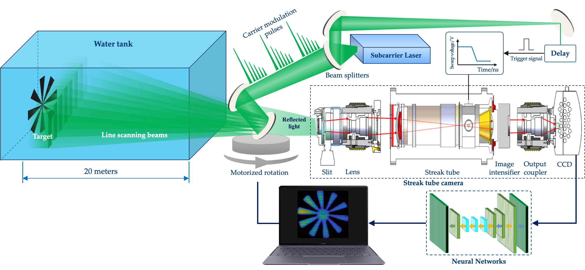

## Introduction

StreakNet is a Deep-Learning (DL) based underwater imaging augmentation network for Streak Tube Camera System. It can achieves **millimeter** resolution underwater imaging at a distance of **20m**. For more details, please refer to out [paper](#).

<div align="center"></div>

## Benchmark

StreakNet Benchmark

|Model|F1-Score|PSNR|Speed V100 (ms/pixel)|Speed NX (ms/pixel)|Params(M)|Weights|
|:---:|:---:|:---:|:---:|:---:|:---:|:---:|
|[StreakNet-s](./exps/streaknet/streaknet_s.py)|00.00|00.00|00.0|00.00|00.00|[BaiduDisk](#)|
|[StreakNet-m](./exps/streaknet/streaknet_s.py)|00.00|00.00|00.0|00.00|00.00|[BaiduDisk](#)|
|[StreakNet-l](./exps/streaknet/streaknet_s.py)|00.00|00.00|00.0|00.00|00.00|[BaiduDisk](#)|
|[StreakNet-x](./exps/streaknet/streaknet_s.py)|00.00|00.00|00.0|00.00|00.00|[BaiduDisk](#)|
|(baseline)|41.07|4.64|00.0|00.00|---|---|


## Quick Start
<details>
<summary>Installation</summary>

Step1. Setup your conda environment.
```sh
conda create -n streaknet python=3.7
conda activate streaknet
```

Step2. Install StreakNet from source.
```sh
git clone https://github.com/BestAnHongjun/StreakNet.git
cd StreakNet
pip install -e .
```
</details>