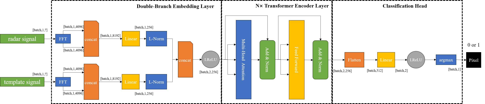

<div align="center"></div>
<div align="center"></div>

## Introduction

[StreakNet](https://github.com/BestAnHongjun/StreakNet) is a Deep-Learning (DL) based underwater imaging augmentation network for **Underwater Streak Camera LiDAR (USCL)** systems. It can achieves **millimeter** resolution underwater imaging at a distance of **20m**. For more details, please refer to our [paper](#).

<div align="center"></div>

## Benchmark

StreakNet Benchmark

|Model|F1-Score (%)|PSNR (dB)|Speed V100 (ms/pixel)|Speed NX (ms/pixel)|Params(M)|Weights|
|:---:|:---:|:---:|:---:|:---:|:---:|:---:|
|[StreakNet-s](./exps/streaknet/streaknet_s.py)|85.46|8.75|00.0|00.00|1.25|[BaiduDisk](#)|
|[StreakNet-m](./exps/streaknet/streaknet_s.py)|85.87|8.91|00.0|00.00|3.15|[BaiduDisk](#)|
|[StreakNet-l](./exps/streaknet/streaknet_s.py)|85.90|8.92|00.0|00.00|10.51|[BaiduDisk](#)|
|[StreakNet-x](./exps/streaknet/streaknet_s.py)|86.23|9.00|00.0|00.00|50.40|[BaiduDisk](#)|
|(baseline)|41.07|4.64|00.0|00.00|---|---|

## Dataset
<details>
<summary>Introduction</summary>

**StreakData** is an underwater imaging dataset for **USCL** systems. It includes a series of streak images caught by a **USCL** system at distances of 10m, 13m, 15m, and 20m. See the table below to learn the details of the dataset.

|Distance|Number of streak images|Resolution of streak images|Resolution of imaged image|Data type|Sample size|
|:---:|:---:|:---:|:---:|:---:|:---:|
|10m|400|2048x2048|2048x400|uint16|819200|
|13m|349|2048x2048|2048x349|uint16|714752|
|15m|300|2048x2048|2048x300|uint16|614400|
|20m|267|2048x2048|2048x267|uint16|546816|

You can download **StreakData** for free at [GoogleDrive](https://drive.google.com/file/d/16RiV8JRL2GVe0GH1oXF4ZcrN2okQq6qG/view?usp=drive_link) or [BaiduDisk](https://pan.baidu.com/s/1QQ0nGwlq0KzwvY8yi2PCaw?pwd=zl76).
</details>

<details>
<summary>Organizational Structure</summary>

When you download **StreakData** from [GoogleDrive](https://drive.google.com/file/d/16RiV8JRL2GVe0GH1oXF4ZcrN2okQq6qG/view?usp=drive_link) or [BaiduDisk](https://pan.baidu.com/s/1QQ0nGwlq0KzwvY8yi2PCaw?pwd=zl76), unzip it and you will get the following directory structure.

```sh
YOUR_UNZIP_DIRECTORY
    |- clean_water_10m      # The directory of data taken at a distance of 10m
    |   |- data             # Original streak images
    |   |   |- 001.tif
    |   |   |- 002.tif
    |   |   |- 003.tif
    |   |   |- ...
    |   |
    |   |- groundtruth.npy  # The ground-truth of the final imaged image
    |   |- preview.jpg      # A preview of the ground-truth
    |
    |- clean_water_13m      # The directory of data taken at a distance of 13m (has the same structure as 10m)
    |- clean_water_15m      # The directory of data taken at a distance of 15m (has the same structure as 10m)
    |- clean_water_20m      # The directory of data taken at a distance of 20m (has the same structure as 10m)
    |- template.npy         # The 1-D time sequence of the template signal
    |- test_config.yaml     # The config file of test-set
    |- train_config.yaml    # The config file of training-set
    |- valid_config.yaml    # The config file of validation-set
```

</details>

## Quick Start
<details>
<summary id="quickstartinstallation">Installation</summary>

Step1. Setup your conda environment. ([What is Anaconda?](https://www.anaconda.com/download))
```sh
conda create -n streaknet python=3.7
conda activate streaknet
```

Step2. Install StreakNet from source.
```sh
git clone https://github.com/BestAnHongjun/StreakNet.git
cd StreakNet
pip install -e .
```
</details>

<details>
<summary>Reproduce Experimental Results</summary>

Step1. Install the StreakNet module by following the [*Installation*](#quickstartinstallation) section.

Step2. Download

</details>